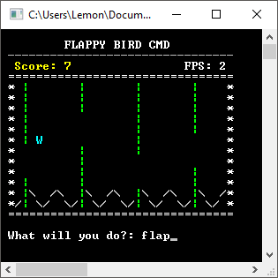

Flappy Bird CMD Game
=======================

Command driven, turn-based version of Flappy Bird written in C++ inspired by the Flappy Jam.

Download here: https://github.com/Teh-Lemon/Flappy-Bird-Command-Line-Game/releases

Note: Has only been tested on Windows 7 64-bit and will require a Windows platform.

Features:
- Flapping!
- Random obstacle generation!
- High scores!
- High definition graphics!
- Sound effects!
- Backgrounds!
- Colours!
- Toggle-able sounds effects, backgrounds and colours!
